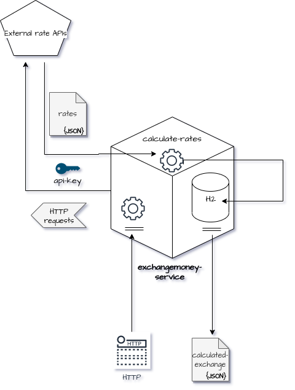

# Exchange Money Service

Is a API responsible for converting between currencies,
using updated conversion rates.

## Architecture Overview

### Heroku
The application was deployed with **heroku**, you can access **[exchangemoney-service](https://exchangemoney-service.herokuapp.com/)** (the first access can be slow).

**Warning**: every commit in master will run a **pipeline** on heroku, deploying application.

### Technologies

* Java 11
* Spring Boot (Web, Data JPA, Actuator)
* H2
* Gradle
* Lombok
* Kotlin DSL
* (CI/CD) Heroku


### Principles and Concepts

* Domain Driven Design
* SOLID
* Clean Code
* CDI

### Motivations

#### Spring Boot
Offers me a range of other libraries, ranging from tests, cloud, REST Apis. And it has a built-in http server.

#### CDI
In this application I purposely used dependency injection without using *@autowired*. I used constructor injection, which makes life easier for developers when writing unit tests and mock injection. Through constructor injection we can see how much our classes are growing and the right time to refactor.
The benefits can be seen [here](https://martinfowler.com/articles/injection.html) and [here](https://raphaelcarvalho.dev/2019/07/22/spring-boot-utilizar-autowired-e-uma-boa-pratica/) 

#### Domain Driven Design
I used of the software modeling approach that follows a set of practices in order to facilitate the implementation of complex rules (which is not the case here), but it is of great help when it comes to understanding what are the problems of the application. DDD prepares any microservice for future contexts, in case of possible application growth.

#### SOLID
I used SOLID because with these principles the software becomes more robust, scalable and flexible, making it tolerant to changes, facilitating the implementation of new requirements for the evolution and maintenance of the system.

#### Spring Validations
If fields necessary for processing the conversion are null, the backend does not need to implement validations with unnecessary **_if_** block encoding

### Architecture



### Installation

Use build automation system [gradlew](https://docs.gradle.org/current/userguide/userguide.html) to compile and run all test classes.


`Linux`
```bash
./gradlew clean build
```

`Windows`
```bash
gradlew clean build
```


### Testing

`Linux`
```bash
./gradlew test
```

`Windows`
```bash
gradlew test
```

### To start application from command line

`Linux`
```bash
./gradlew bootRun
```

`Windows`
```bash
gradlew bootRun
```


### Endpoints

| Method | URI              | Description              | Response Status            |
| ------ | ---------------- | ------------------------ | -------------------------- |
| `POST` | `/transactions` | *create new converting transaction*    | `201`, `422`, `500` |
| `GET` | `/transactions/customers/{taxId}` | *find transactions converted by customer*    | `200`, `404`, `500` |

#### POST `/transactions`

| Attribute | Mandatory              | Description              | Type            |
| ------ | ---------------- | ------------------------ | -------------------------- |
| `taxId` | `yes` | *taxId is like 'cpf' or a person's ID*    | `string` |
| `amount` | `yes` | *origin value to be converted*    | `numeric` |
| `from` | `yes` | *currency of origin of value*    | `string` |
| `to` | `yes` | *currency of destiny of value*    | `string` |

*Exanples below:*

`body`

```json
{
  "taxId": "05267832498",
  "amount": 10,
  "from":"BRL",
  "to":"USD"
}
```

`response`

```json
{
   "transactionId": "55f0c119-d4e7-4034-8f95-ebf00e318d5b",
   "customerId": "55f0c119-d4e7-4034-8f95-ebf00e318d5b",
   "from": "BRL",
   "origin": 10.0,
   "to": "USD",
   "destiny": 3.82,
   "rate": 0.19,
   "occurredOn": "2021-06-07T18:04:22.685898-03:00"
}
```

#### GET `/transactions/customers/05267832498`

`response`

```json
[
  {
   "transactionId": "55f0c119-d4e7-4034-8f95-ebf00e318d5b",
   "customerId": "55f0c119-d4e7-4034-8f95-ebf00e318d5b",
   "from": "BRL",
   "origin": 10.0,
   "to": "USD",
   "destiny": 3.82,
   "rate": 0.19,
   "occurredOn": "2021-06-07T18:04:22.685898-03:00"
  }, 
  {
    "transactionId": "342fb32f-5bc0-4082-8ca5-21c102b3dfa3",
    "customerId": "55f0c119-d4e7-4034-8f95-ebf00e318d5b",
    "from": "USD",
    "origin": 10.0,
    "to": "JPY",
    "destiny": 1096.65,
    "rate": 109.66,
    "occurredOn": "2021-06-08T22:04:22.685898-03:00"
  }
]
```
